# Multi-Region EKS Deployment Architecture for Orasi

## Overview

This document provides a comprehensive guide for deploying Orasi agents, gateways, and bridges across multiple AWS regions using Amazon EKS. The architecture is designed for high availability, fault tolerance, and global observability.

## Architecture Diagram

```mermaid
graph TB
    %% AWS Regions
    subgraph "AWS Region: us-east-1 (Primary)"
        subgraph "EKS Cluster: orasi-primary"
            subgraph "Namespace: orasi-system"
                %% Primary Bridge Components
                BridgeAPI1[Bridge API<br/>Service Load Balancer]
                BridgeAPI2[Bridge API<br/>Replica]
                SchemaReg1[Schema Registry<br/>Primary]
                QueryEngine1[Query Engine<br/>Primary]
                StreamProc1[Streaming Processor<br/>Primary]
            end
            
            subgraph "Namespace: orasi-gateway"
                %% Primary Gateway Components
                Gateway1[Orasi Gateway<br/>Primary]
                Gateway2[Orasi Gateway<br/>Replica]
                GatewayLB[Gateway Load Balancer<br/>NLB]
            end
            
            subgraph "Namespace: orasi-agents"
                %% Agent Components
                Agent1[Orasi Agent<br/>Node 1]
                Agent2[Orasi Agent<br/>Node 2]
                Agent3[Orasi Agent<br/>Node 3]
            end
        end
        
        %% Infrastructure Services
        subgraph "Infrastructure Services"
            ETCD1[etcd Cluster<br/>Primary]
            Prometheus1[Prometheus<br/>Primary]
            Grafana1[Grafana<br/>Primary]
            Redis1[Redis Cache<br/>Primary]
        end
        
        %% Storage
        subgraph "Storage Layer"
            S3Primary[S3 Bucket<br/>orasi-telemetry-us-east-1]
            RDS1[RDS PostgreSQL<br/>Primary]
        end
    end
    
    subgraph "AWS Region: us-west-2 (Secondary)"
        subgraph "EKS Cluster: orasi-secondary"
            subgraph "Namespace: orasi-system"
                %% Secondary Bridge Components
                BridgeAPI3[Bridge API<br/>Secondary]
                SchemaReg2[Schema Registry<br/>Secondary]
                QueryEngine2[Query Engine<br/>Secondary]
                StreamProc2[Streaming Processor<br/>Secondary]
            end
            
            subgraph "Namespace: orasi-gateway"
                %% Secondary Gateway Components
                Gateway3[Orasi Gateway<br/>Secondary]
                Gateway4[Orasi Gateway<br/>Replica]
                GatewayLB2[Gateway Load Balancer<br/>NLB]
            end
            
            subgraph "Namespace: orasi-agents"
                %% Agent Components
                Agent4[Orasi Agent<br/>Node 1]
                Agent5[Orasi Agent<br/>Node 2]
                Agent6[Orasi Agent<br/>Node 3]
            end
        end
        
        %% Infrastructure Services
        subgraph "Infrastructure Services"
            ETCD2[etcd Cluster<br/>Secondary]
            Prometheus2[Prometheus<br/>Secondary]
            Grafana2[Grafana<br/>Secondary]
            Redis2[Redis Cache<br/>Secondary]
        end
        
        %% Storage
        subgraph "Storage Layer"
            S3Secondary[S3 Bucket<br/>orasi-telemetry-us-west-2]
            RDS2[RDS PostgreSQL<br/>Secondary]
        end
    end
    
    subgraph "AWS Region: eu-west-1 (Tertiary)"
        subgraph "EKS Cluster: orasi-tertiary"
            subgraph "Namespace: orasi-gateway"
                %% Tertiary Gateway Components
                Gateway5[Orasi Gateway<br/>Tertiary]
                GatewayLB3[Gateway Load Balancer<br/>NLB]
            end
            
            subgraph "Namespace: orasi-agents"
                %% Agent Components
                Agent7[Orasi Agent<br/>Node 1]
                Agent8[Orasi Agent<br/>Node 2]
            end
        end
        
        %% Infrastructure Services
        subgraph "Infrastructure Services"
            ETCD3[etcd Cluster<br/>Tertiary]
            Prometheus3[Prometheus<br/>Tertiary]
        end
        
        %% Storage
        subgraph "Storage Layer"
            S3Tertiary[S3 Bucket<br/>orasi-telemetry-eu-west-1]
        end
    end
    
    %% Global Load Balancer
    subgraph "Global Load Balancing"
        Route53[Route 53<br/>Global Load Balancer]
        CloudFront[CloudFront<br/>CDN]
    end
    
    %% External Data Sources
    subgraph "External Data Sources"
        App1[Application 1<br/>OTLP/OTAP]
        App2[Application 2<br/>OTLP/OTAP]
        App3[Application 3<br/>OTLP/OTAP]
        IoT[IoT Devices<br/>OTLP]
        Legacy[Legacy Systems<br/>Custom Protocols]
    end
    
    %% Data Lake Storage
    subgraph "Global Data Lake"
        S3Global[S3 Global<br/>orasi-telemetry-global]
        Glue[Glue Data Catalog]
        Athena[Athena Query Engine]
        LakeFormation[Lake Formation<br/>Governance]
    end
    
    %% Connections
    %% External to Gateways
    App1 --> GatewayLB
    App2 --> GatewayLB2
    App3 --> GatewayLB3
    IoT --> GatewayLB
    Legacy --> GatewayLB
    
    %% Gateways to Agents
    GatewayLB --> Agent1
    GatewayLB --> Agent2
    GatewayLB --> Agent3
    GatewayLB2 --> Agent4
    GatewayLB2 --> Agent5
    GatewayLB2 --> Agent6
    GatewayLB3 --> Agent7
    GatewayLB3 --> Agent8
    
    %% Agents to Bridge APIs
    Agent1 --> BridgeAPI1
    Agent2 --> BridgeAPI1
    Agent3 --> BridgeAPI1
    Agent4 --> BridgeAPI3
    Agent5 --> BridgeAPI3
    Agent6 --> BridgeAPI3
    Agent7 --> BridgeAPI1
    Agent8 --> BridgeAPI1
    
    %% Bridge Components to Storage
    BridgeAPI1 --> S3Primary
    BridgeAPI1 --> RDS1
    BridgeAPI3 --> S3Secondary
    BridgeAPI3 --> RDS2
    
    %% Cross-region replication
    S3Primary -.->|S3 Replication| S3Global
    S3Secondary -.->|S3 Replication| S3Global
    S3Tertiary -.->|S3 Replication| S3Global
    
    %% Global services
    Route53 --> GatewayLB
    Route53 --> GatewayLB2
    Route53 --> GatewayLB3
    CloudFront --> Route53
    
    %% Monitoring connections
    Prometheus1 --> BridgeAPI1
    Prometheus1 --> Gateway1
    Prometheus1 --> Agent1
    Prometheus2 --> BridgeAPI3
    Prometheus2 --> Gateway3
    Prometheus2 --> Agent4
    Prometheus3 --> Gateway5
    Prometheus3 --> Agent7
    
    %% etcd connections
    ETCD1 --> BridgeAPI1
    ETCD1 --> Gateway1
    ETCD2 --> BridgeAPI3
    ETCD2 --> Gateway3
    ETCD3 --> Gateway5
    
    %% Cross-region etcd
    ETCD1 -.->|etcd Cluster| ETCD2
    ETCD2 -.->|etcd Cluster| ETCD3
```



## Component Architecture

### 1. Orasi Agents

**Purpose**: Collect telemetry data from applications and forward to gateways/bridges

**Deployment Pattern**:
- **DaemonSet**: One agent per node for comprehensive coverage
- **ReplicaSet**: Multiple replicas for high availability
- **Node Affinity**: Deploy on specific node types (compute-optimized)

**Key Features**:
- OTLP/OTAP protocol support
- Local buffering and batching
- Automatic service discovery
- Health monitoring and metrics

**Resource Requirements**:
```yaml
resources:
  requests:
    memory: "512Mi"
    cpu: "250m"
  limits:
    memory: "2Gi"
    cpu: "1000m"
```

### 2. Orasi Gateways

**Purpose**: Load balancing, protocol translation, and regional aggregation

**Deployment Pattern**:
- **Deployment**: Multiple replicas for high availability
- **Service**: Network Load Balancer for external access
- **Horizontal Pod Autoscaler**: Auto-scale based on load

**Key Features**:
- Protocol translation (OTLP ↔ OTAP)
- Load balancing across agents
- Regional data aggregation
- Circuit breaker and retry logic

**Resource Requirements**:
```yaml
resources:
  requests:
    memory: "1Gi"
    cpu: "500m"
  limits:
    memory: "4Gi"
    cpu: "2000m"
```

### 3. Orasi Bridges

**Purpose**: Core data processing, storage, and query engine

**Deployment Pattern**:
- **StatefulSet**: For persistent storage requirements
- **Deployment**: For stateless components
- **Service**: ClusterIP for internal communication

**Components**:
- **Bridge API**: REST/gRPC API server
- **Schema Registry**: Schema management and validation
- **Query Engine**: SQL query processing
- **Streaming Processor**: Real-time data processing

**Resource Requirements**:
```yaml
resources:
  requests:
    memory: "2Gi"
    cpu: "1000m"
  limits:
    memory: "8Gi"
    cpu: "4000m"
```

## Deployment Strategy

### 1. Primary Region (us-east-1)

**Responsibilities**:
- Primary data processing and storage
- Global coordination and management
- Disaster recovery coordination

**Components**:
- Full bridge deployment (API, Schema Registry, Query Engine, Streaming Processor)
- Multiple gateway replicas
- Complete agent coverage
- Primary etcd cluster
- Primary monitoring stack

### 2. Secondary Region (us-west-2)

**Responsibilities**:
- Secondary data processing
- Regional data aggregation
- Failover capabilities

**Components**:
- Bridge API and core components
- Multiple gateway replicas
- Complete agent coverage
- Secondary etcd cluster
- Secondary monitoring stack

### 3. Tertiary Region (eu-west-1)

**Responsibilities**:
- Regional data collection
- Local processing for EU compliance
- Backup and disaster recovery

**Components**:
- Gateway deployment
- Agent deployment
- Basic monitoring
- Local storage

## Networking Architecture

### 1. VPC Configuration

```yaml
# Primary Region VPC
vpc:
  cidr: "10.0.0.0/16"
  subnets:
    public:
      - cidr: "10.0.1.0/24"
      - cidr: "10.0.2.0/24"
    private:
      - cidr: "10.0.10.0/24"
      - cidr: "10.0.11.0/24"
    database:
      - cidr: "10.0.20.0/24"
      - cidr: "10.0.21.0/24"
```

### 2. Cross-Region Connectivity

- **VPC Peering**: Between regions for direct communication
- **Transit Gateway**: For complex multi-region routing
- **PrivateLink**: For secure service-to-service communication

### 3. Load Balancing

- **Application Load Balancer**: For HTTP/HTTPS traffic
- **Network Load Balancer**: For TCP/UDP traffic (OTLP/OTAP)
- **Global Accelerator**: For global load balancing

## Storage Architecture

### 1. Data Lake Strategy

```yaml
storage:
  global:
    bucket: "orasi-telemetry-global"
    region: "us-east-1"
    replication:
      - region: "us-west-2"
      - region: "eu-west-1"
  
  regional:
    us-east-1:
      bucket: "orasi-telemetry-us-east-1"
      storage_class: "STANDARD_IA"
    us-west-2:
      bucket: "orasi-telemetry-us-west-2"
      storage_class: "STANDARD_IA"
    eu-west-1:
      bucket: "orasi-telemetry-eu-west-1"
      storage_class: "STANDARD_IA"
```

### 2. Database Strategy

- **Primary RDS**: PostgreSQL in us-east-1
- **Read Replicas**: In secondary regions
- **Multi-AZ**: For high availability
- **Automated Backups**: Cross-region backup storage

### 3. Caching Strategy

- **Redis Cluster**: Primary in us-east-1
- **Redis Replicas**: In secondary regions
- **ElastiCache**: Managed Redis service
- **Cross-Region Replication**: For global cache consistency

## Monitoring and Observability

### 1. Prometheus Configuration

```yaml
prometheus:
  global:
    scrape_interval: 15s
    evaluation_interval: 15s
  
  rule_files:
    - "orasi-rules.yml"
  
  scrape_configs:
    - job_name: 'orasi-agents'
      kubernetes_sd_configs:
        - role: pod
      relabel_configs:
        - source_labels: [__meta_kubernetes_pod_label_app]
          regex: orasi-agent
          action: keep
    
    - job_name: 'orasi-gateways'
      kubernetes_sd_configs:
        - role: service
      relabel_configs:
        - source_labels: [__meta_kubernetes_service_label_app]
          regex: orasi-gateway
          action: keep
    
    - job_name: 'orasi-bridges'
      kubernetes_sd_configs:
        - role: service
      relabel_configs:
        - source_labels: [__meta_kubernetes_service_label_app]
          regex: orasi-bridge
          action: keep
```

### 2. Grafana Dashboards

- **Global Overview**: Cross-region metrics and health
- **Regional Details**: Per-region performance and capacity
- **Component Health**: Individual service health and metrics
- **Data Flow**: Telemetry data flow visualization

### 3. Alerting Strategy

```yaml
alerts:
  - name: "High Latency"
    condition: "histogram_quantile(0.95, rate(http_request_duration_seconds_bucket[5m])) > 0.5"
    severity: "warning"
  
  - name: "High Error Rate"
    condition: "rate(http_requests_total{status=~\"5..\"}[5m]) / rate(http_requests_total[5m]) > 0.05"
    severity: "critical"
  
  - name: "Storage Capacity"
    condition: "orasi_storage_usage_percent > 80"
    severity: "warning"
```

## Security Architecture

### 1. Network Security

- **Security Groups**: Restrict traffic between components
- **Network Policies**: Kubernetes network policies for pod-to-pod communication
- **Private Subnets**: All components in private subnets
- **NAT Gateways**: For outbound internet access

### 2. Authentication and Authorization

- **IAM Roles**: Service accounts with minimal permissions
- **OIDC Provider**: For Kubernetes service accounts
- **RBAC**: Role-based access control in Kubernetes
- **API Gateway**: For external API access

### 3. Data Security

- **Encryption at Rest**: All storage encrypted
- **Encryption in Transit**: TLS for all communications
- **Secrets Management**: AWS Secrets Manager for sensitive data
- **Audit Logging**: Comprehensive audit trails

## Disaster Recovery

### 1. Backup Strategy

- **Automated Backups**: Daily automated backups
- **Cross-Region Replication**: S3 and RDS cross-region replication
- **Point-in-Time Recovery**: RDS point-in-time recovery
- **Configuration Backups**: Infrastructure as Code backups

### 2. Recovery Procedures

```yaml
recovery:
  rto: "4 hours"  # Recovery Time Objective
  rpo: "1 hour"   # Recovery Point Objective
  
  procedures:
    - name: "Primary Region Failure"
      steps:
        - "Promote secondary region to primary"
        - "Update DNS and load balancer configuration"
        - "Scale up secondary region resources"
        - "Verify data consistency"
    
    - name: "Data Corruption"
      steps:
        - "Identify corrupted data"
        - "Restore from backup"
        - "Replay transaction logs"
        - "Verify data integrity"
```

### 3. Testing

- **Regular DR Tests**: Monthly disaster recovery testing
- **Automated Failover Tests**: Weekly automated failover testing
- **Data Recovery Tests**: Quarterly data recovery testing

## Performance Optimization

### 1. Resource Optimization

- **Horizontal Pod Autoscaling**: Based on CPU and memory usage
- **Vertical Pod Autoscaling**: For resource optimization
- **Cluster Autoscaling**: For node-level scaling
- **Resource Quotas**: To prevent resource exhaustion

### 2. Network Optimization

- **Service Mesh**: Istio for advanced traffic management
- **Connection Pooling**: Optimized connection management
- **Load Balancing**: Intelligent load distribution
- **CDN**: CloudFront for global content delivery

### 3. Storage Optimization

- **Data Compression**: Automatic data compression
- **Data Lifecycle**: Automated data lifecycle management
- **Caching**: Multi-level caching strategy
- **Partitioning**: Intelligent data partitioning

## Deployment Automation

### 1. Infrastructure as Code

```yaml
# Terraform configuration example
module "orasi_eks" {
  source = "./modules/eks"
  
  cluster_name = "orasi-${var.environment}"
  region       = var.region
  
  node_groups = {
    compute = {
      instance_types = ["c5.2xlarge"]
      min_size       = 2
      max_size       = 10
    }
    storage = {
      instance_types = ["r5.2xlarge"]
      min_size       = 2
      max_size       = 5
    }
  }
}
```

### 2. CI/CD Pipeline

```yaml
# GitHub Actions workflow example
name: Deploy Orasi
on:
  push:
    branches: [main]

jobs:
  deploy:
    runs-on: ubuntu-latest
    steps:
      - uses: actions/checkout@v2
      
      - name: Build Docker images
        run: |
          docker build -t orasi/agent:${{ github.sha }} ./app/orasi-agent
          docker build -t orasi/gateway:${{ github.sha }} ./app/orasi-gateway
          docker build -t orasi/bridge:${{ github.sha }} ./app/orasi-bridge
      
      - name: Deploy to EKS
        run: |
          kubectl apply -f k8s/
          kubectl set image deployment/orasi-agent orasi-agent=orasi/agent:${{ github.sha }}
          kubectl set image deployment/orasi-gateway orasi-gateway=orasi/gateway:${{ github.sha }}
          kubectl set image deployment/orasi-bridge orasi-bridge=orasi/bridge:${{ github.sha }}
```

### 3. Configuration Management

- **Helm Charts**: For Kubernetes deployment
- **ConfigMaps**: For application configuration
- **Secrets**: For sensitive configuration
- **Operators**: For complex state management

## Cost Optimization

### 1. Resource Optimization

- **Spot Instances**: For non-critical workloads
- **Reserved Instances**: For predictable workloads
- **Auto Scaling**: Right-size resources automatically
- **Resource Monitoring**: Track and optimize resource usage

### 2. Storage Optimization

- **Lifecycle Policies**: Move data to cheaper storage classes
- **Compression**: Reduce storage costs
- **Deduplication**: Eliminate duplicate data
- **Archival**: Move old data to archival storage

### 3. Network Optimization

- **Data Transfer**: Minimize cross-region data transfer
- **CDN**: Use CloudFront for global content delivery
- **PrivateLink**: Use private connections where possible
- **VPC Endpoints**: Reduce NAT gateway costs

## Conclusion

This multi-region EKS deployment architecture provides:

1. **High Availability**: Redundant components across regions
2. **Fault Tolerance**: Automatic failover and recovery
3. **Global Scalability**: Distributed processing and storage
4. **Security**: Comprehensive security controls
5. **Observability**: Complete monitoring and alerting
6. **Cost Optimization**: Efficient resource utilization

The architecture is designed to handle production workloads with enterprise-grade reliability, security, and performance requirements.
