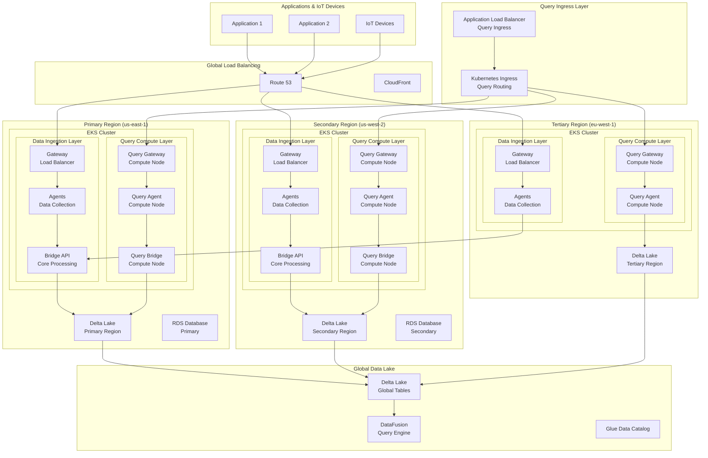

# Multi-Region EKS Deployment - Simplified View

## High-Level Architecture



## Component Deployment Strategy

### 1. Orasi Agents (DaemonSet)
```yaml
# Deploy one agent per node
apiVersion: apps/v1
kind: DaemonSet
metadata:
  name: orasi-agent
spec:
  selector:
    matchLabels:
      app: orasi-agent
  template:
    spec:
      containers:
      - name: agent
        image: orasi/agent:latest
        ports:
        - containerPort: 4317  # OTLP gRPC
        - containerPort: 4318  # OTLP HTTP
        - containerPort: 4319  # OTAP
```

### 2. Orasi Gateways (Deployment)
```yaml
# Deploy multiple replicas for high availability
apiVersion: apps/v1
kind: Deployment
metadata:
  name: orasi-gateway
spec:
  replicas: 3
  selector:
    matchLabels:
      app: orasi-gateway
  template:
    spec:
      containers:
      - name: gateway
        image: orasi/gateway:latest
        ports:
        - containerPort: 8080  # HTTP API
        - containerPort: 9090  # gRPC API
```

### 3. Orasi Bridges (StatefulSet)
```yaml
# Deploy with persistent storage
apiVersion: apps/v1
kind: StatefulSet
metadata:
  name: orasi-bridge
spec:
  serviceName: orasi-bridge
  replicas: 2
  selector:
    matchLabels:
      app: orasi-bridge
  template:
    spec:
      containers:
      - name: bridge
        image: orasi/bridge:latest
        ports:
        - containerPort: 8080  # REST API
        - containerPort: 9090  # gRPC API
        env:
        - name: DELTA_LAKE_STORAGE_PATH
          value: "s3://orasi-telemetry-delta-lake"
        - name: DELTA_LAKE_CATALOG
          value: "hive"
        - name: DELTA_LAKE_TABLE_FORMAT_VERSION
          value: "2"
        - name: DELTA_LAKE_ENABLE_TRANSACTIONS
          value: "true"
        - name: DELTA_LAKE_PARTITION_COLUMNS
          value: "service_name,date,hour"
        - name: DELTA_LAKE_COMPRESSION
          value: "zstd"
```

### 4. Query Ingress (Ingress)
```yaml
# Kubernetes Ingress for query routing
apiVersion: networking.k8s.io/v1
kind: Ingress
metadata:
  name: orasi-query-ingress
  annotations:
    kubernetes.io/ingress.class: "alb"
    alb.ingress.kubernetes.io/scheme: "internet-facing"
    alb.ingress.kubernetes.io/target-type: "ip"
    alb.ingress.kubernetes.io/listen-ports: '[{"HTTP": 80}, {"HTTPS": 443}]'
    alb.ingress.kubernetes.io/ssl-redirect: "443"
spec:
  rules:
  - host: query.orasi.example.com
    http:
      paths:
      - path: /api/v1/query
        pathType: Prefix
        backend:
          service:
            name: orasi-query-gateway
            port:
              number: 8080
      - path: /api/v1/analytics
        pathType: Prefix
        backend:
          service:
            name: orasi-query-bridge
            port:
              number: 8080
```

### 5. Query Compute Nodes (Deployment)
```yaml
# Query Gateway Compute Nodes
apiVersion: apps/v1
kind: Deployment
metadata:
  name: orasi-query-gateway
spec:
  replicas: 3
  selector:
    matchLabels:
      app: orasi-query-gateway
  template:
    spec:
      nodeSelector:
        node-type: query-compute
      containers:
      - name: query-gateway
        image: orasi/gateway:latest
        ports:
        - containerPort: 8080  # Query API
        - containerPort: 9090  # gRPC API
        resources:
          requests:
            memory: "2Gi"
            cpu: "1000m"
          limits:
            memory: "8Gi"
            cpu: "4000m"
        env:
        - name: COMPUTE_MODE
          value: "query"
        - name: QUERY_CACHE_SIZE
          value: "4Gi"
        - name: QUERY_TIMEOUT_SECONDS
          value: "300"

---
# Query Agent Compute Nodes
apiVersion: apps/v1
kind: Deployment
metadata:
  name: orasi-query-agent
spec:
  replicas: 3
  selector:
    matchLabels:
      app: orasi-query-agent
  template:
    spec:
      nodeSelector:
        node-type: query-compute
      containers:
      - name: query-agent
        image: orasi/agent:latest
        ports:
        - containerPort: 8080  # Query API
        - containerPort: 9090  # gRPC API
        resources:
          requests:
            memory: "1Gi"
            cpu: "500m"
          limits:
            memory: "4Gi"
            cpu: "2000m"
        env:
        - name: COMPUTE_MODE
          value: "query"
        - name: QUERY_WORKER_THREADS
          value: "8"

---
# Query Bridge Compute Nodes
apiVersion: apps/v1
kind: Deployment
metadata:
  name: orasi-query-bridge
spec:
  replicas: 2
  selector:
    matchLabels:
      app: orasi-query-bridge
  template:
    spec:
      nodeSelector:
        node-type: query-compute
      containers:
      - name: query-bridge
        image: orasi/bridge:latest
        ports:
        - containerPort: 8080  # Query API
        - containerPort: 9090  # gRPC API
        resources:
          requests:
            memory: "4Gi"
            cpu: "2000m"
          limits:
            memory: "16Gi"
            cpu: "8000m"
        env:
        - name: COMPUTE_MODE
          value: "query"
        - name: DELTA_LAKE_STORAGE_PATH
          value: "s3://orasi-telemetry-delta-lake"
        - name: QUERY_ENGINE_WORKER_THREADS
          value: "16"
        - name: QUERY_CACHE_SIZE
          value: "8Gi"
```

## Delta Lake Configuration

### Regional Delta Lake Setup
```yaml
# Delta Lake configuration for each region
delta_lake:
  primary:
    storage_path: "s3://orasi-telemetry-us-east-1/delta-lake"
    catalog: "hive"
    table_format_version: 2
    enable_transactions: true
    partition_columns: ["service_name", "date", "hour"]
    compression: "zstd"
  
  secondary:
    storage_path: "s3://orasi-telemetry-us-west-2/delta-lake"
    catalog: "hive"
    table_format_version: 2
    enable_transactions: true
    partition_columns: ["service_name", "date", "hour"]
    compression: "zstd"
  
  global:
    storage_path: "s3://orasi-telemetry-global/delta-lake"
    catalog: "hive"
    table_format_version: 2
    enable_transactions: true
    partition_columns: ["region", "service_name", "date", "hour"]
    compression: "zstd"
```

### Delta Lake Tables
```sql
-- Telemetry data table
CREATE TABLE telemetry_data (
  timestamp TIMESTAMP,
  service_name STRING,
  trace_id STRING,
  span_id STRING,
  parent_span_id STRING,
  operation_name STRING,
  duration_ms DOUBLE,
  status_code INTEGER,
  attributes MAP<STRING, STRING>,
  region STRING
)
USING DELTA
PARTITIONED BY (service_name, date, hour)
LOCATION 's3://orasi-telemetry-global/delta-lake/telemetry_data'

-- Metrics data table
CREATE TABLE metrics_data (
  timestamp TIMESTAMP,
  metric_name STRING,
  metric_value DOUBLE,
  metric_unit STRING,
  service_name STRING,
  labels MAP<STRING, STRING>,
  region STRING
)
USING DELTA
PARTITIONED BY (service_name, date, hour)
LOCATION 's3://orasi-telemetry-global/delta-lake/metrics_data'
```

## Key Benefits

1. **High Availability**: Components replicated across regions
2. **Global Scalability**: Distributed processing and storage
3. **Fault Tolerance**: Automatic failover between regions
4. **Data Locality**: Regional data processing for compliance
5. **Cost Optimization**: Efficient resource utilization
6. **ACID Transactions**: Delta Lake provides ACID guarantees
7. **Schema Evolution**: Automatic schema evolution support
8. **Time Travel**: Point-in-time data access capabilities

## Compute Node Strategy

### Node Groups
```yaml
# EKS Node Groups for different workloads
node_groups:
  ingestion:
    instance_types: ["c5.xlarge", "c5.2xlarge"]
    min_size: 2
    max_size: 10
    labels:
      node-type: ingestion
    taints:
      - key: workload
        value: ingestion
        effect: NoSchedule
  
  query-compute:
    instance_types: ["r5.2xlarge", "r5.4xlarge", "r5.8xlarge"]
    min_size: 3
    max_size: 20
    labels:
      node-type: query-compute
    taints:
      - key: workload
        value: query
        effect: NoSchedule
  
  storage:
    instance_types: ["i3.2xlarge", "i3.4xlarge"]
    min_size: 2
    max_size: 8
    labels:
      node-type: storage
    taints:
      - key: workload
        value: storage
        effect: NoSchedule
```

### Workload Separation
- **Ingestion Layer**: Optimized for high-throughput data collection
- **Query Compute Layer**: Optimized for analytical query processing
- **Storage Layer**: Optimized for Delta Lake operations

## Traffic Flow

1. **Data Ingestion**: Applications → Route 53 → Regional Gateways → Agents → Bridge APIs → Regional Delta Lake
2. **Data Replication**: Regional Delta Lake → Global Delta Lake
3. **Query Processing**: Applications → Query Ingress → Query Compute Nodes → Global Delta Lake → DataFusion
4. **Analytics**: Query Bridge → Delta Lake → Advanced Analytics
